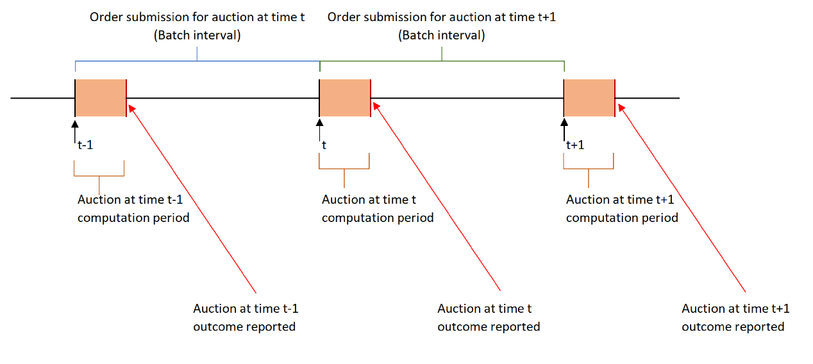

# Frequent Batch Auctions (FBA)

Ithaca uses a Frequent Batch Auction (FBA) mechanism to match orders.&#x20;

FBAs run across multiple orderbooks with different products, underlyings, maturities; which allows for the seamless handling as well as synchronized execution of multi-leg linked / conditional orders. Such design ensures that Ithaca features High-Frequency-Trading (HFT) resistance that is thought of as creating a fairer level playing field for all participants.

<figure><figcaption></figcaption></figure>

The FBA process is similar to traditional auction models implemented in many market places. The main difference to traditional auction processes is the duration of each auction cycle. Frequent Batch Auction cycles are very short and are immediately followed by the next FBA cycle.

**Order Submission Period**

During the Order Submission Period of an FBA, new orders can be submitted into the order book, existing orders can be cancelled, however no orders are being matched and no match prices are being generated.

During the Order Submission Period, only limited market data about the state of the order pool is being disseminated including indications for current bid and offer side sizes including volume stemming from conditional orders.

**Matching (Computation) Period**

At the end of the Order Submission Period, the Matching Period starts. At this point new orders are not accepted into the current auction cycle any more but are instead placed into a temporary queue outside the orderbook until the next Order Submission Period opens. During the Matching Phase, the Ithaca Matching Engine will evaluate all live Buy and Sell orders including conditional orders. At the conclusion of the Matching Period the Matching Engine determines a single Match-Price per each contract.
